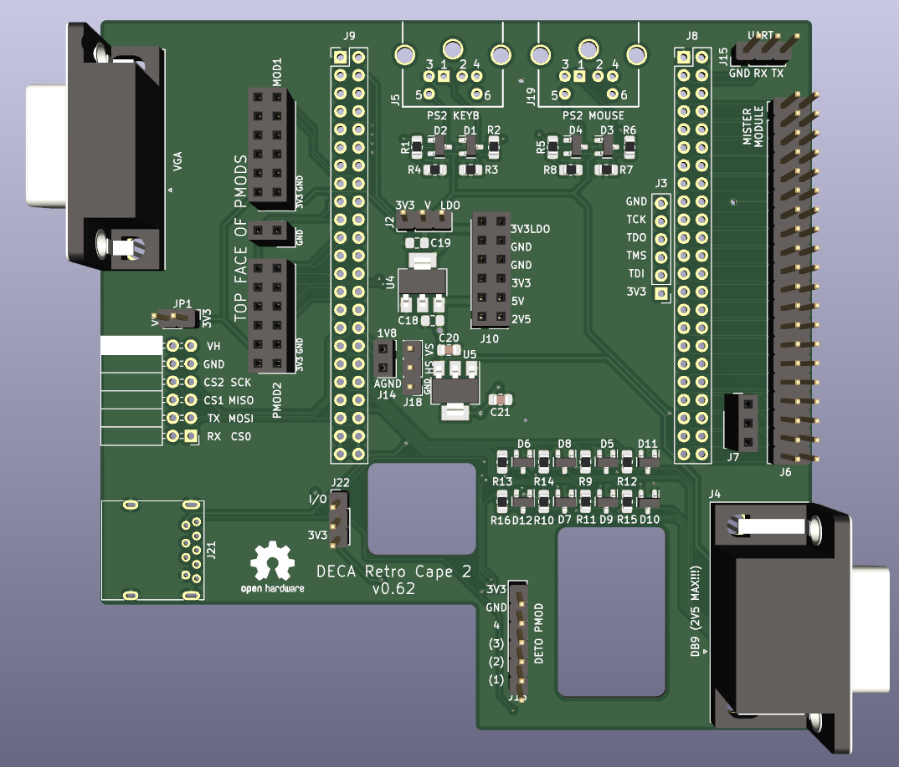
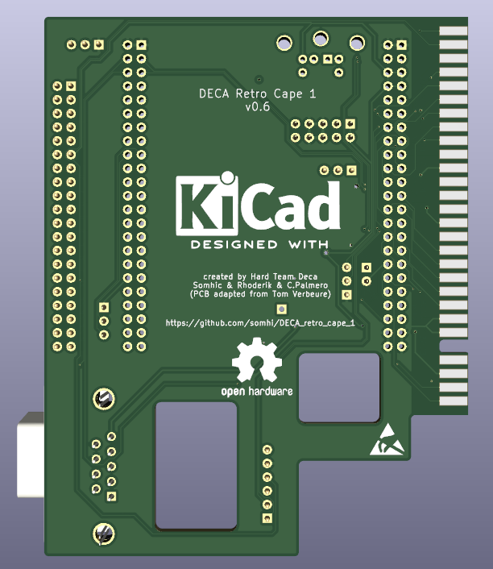

# Arrow DECA Retro Cape 2 (2 layer - MiSTer module SDRAM version)

**STATUS (15/03/22):  prototype desing work finished. v0.71 gerbers sent to JLCPCB for manufacturing.**

Project has been developed with KiCAD 6.0. 

### **Schematic**

 [arrow_deca_retro_cape.pdf](arrow_deca_retro_cape.pdf) 

### **Features**

* VGA DAC 444
* Terasic 40 pin connector (for Mister SDRAM modules) + 3 pin for Dual SDRAM/SRAM 
* PS2 keyboard & mouse connectors
* Double Pmod (1/2) for peripherals (VGA Pmod, Hyperram, ...)
* Pmod 3 (SPI + UART) host or peripheral 
* DETO Pmod (6 pin) for general usage (3 multiplexed pins)
* DB9 connector for joystick (Sega megadrive) compatible with A.Villena MiSTer DB9 addons
* USB3 User Port (for SNAC adapters SNES, Atari, ...)
* UART (Rx/Tx) header
* Power supply header (5V, 3V3, 3V3 LDO, 2V5 LDO, 1V8 analog)

### 3D model

### **Jumper Selection**

* JP1 jumper select Pmod 3 acting as peripheral (no jumper) or host (with jumper)

* JP2 jumper selects 3V3 power supply from Deca board or from LDO (5V to 3V3)

  

### Changelog

v0.5  routed finalized

v0.6  MiSTer SDRAM only version. Changed to 2 layer board.

v0.62 all finished except VGA R2R schematic and routing

v0.65 power header changed, minor aesthetic changes

v0.68 added vga schematic and indiv. R 0805 into layout

v0.70 routing finished including vga

v0.71 finished prototype desing. Gerber sent to JLCPCB for manufacturing.
