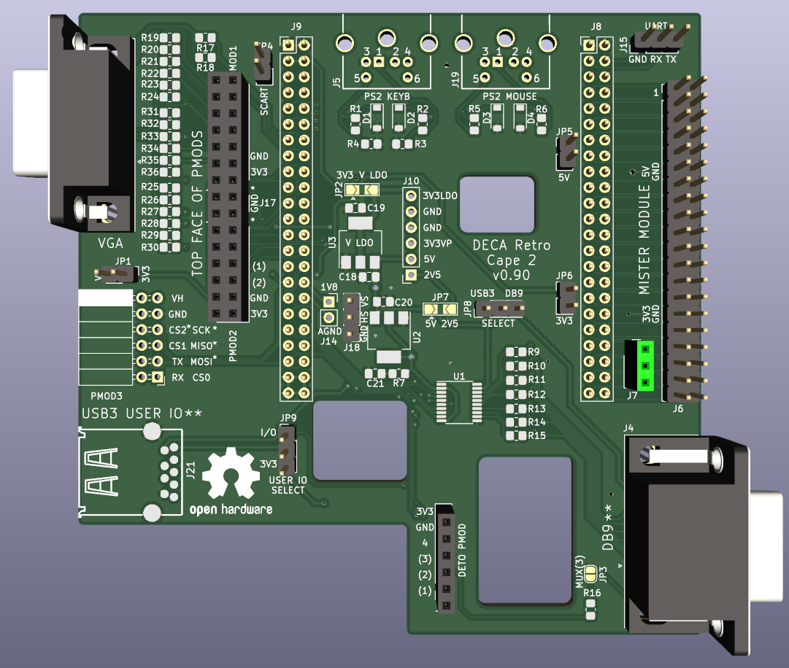
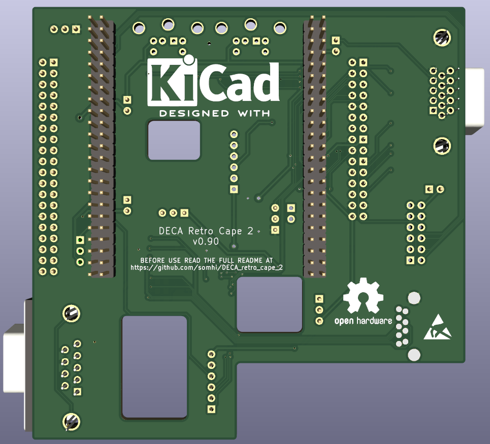
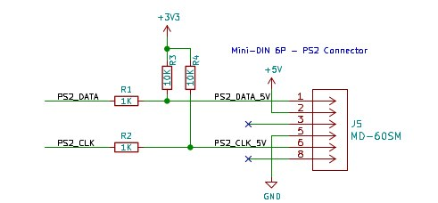

# DECA Retro Cape 2 (2 layer - MiSTer module SDRAM version)

**STATUS** (15/03/22):  prototype desing work finished. v0.71 gerbers sent to JLCPCB for manufacturing.

**STATUS** (07/04/22):  PCBs received. Started testing. **Keyboard and Joystick (DB9 and USB3) protections must be redesigned in the next release**. See end of readme for changelog and improvements from v0.71

Project has been developed with KiCAD 6.0. 

I want to give credits to Tom Verbeure from whom I've taken his [original design  files](https://github.com/tomverbeure/arrow_deca_retro_cape) and adapted to my own design. Not much have been left from his design, but the name "DECA Retro Cape" remains.  

### **Schematic**

 [arrow_deca_retro_cape.pdf](arrow_deca_retro_cape.pdf) 

### **Features**

* VGA DAC 444
* Terasic 40 pin connector (for Mister SDRAM modules) + 3 pin for Dual SDRAM/SRAM 
* PS2 keyboard & mouse connectors
* Double Pmod (1/2) for peripherals (VGA Pmod, Hyperram, ...)
* Pmod 3 (SPI + UART) host or peripheral 
* DETO Pmod (6 pin) for general usage (3 multiplexed pins)
* DB9 connector for joystick (Sega megadrive) compatible with A.Villena MiSTer DB9 addons
* USB3 User Port (for SNAC adapters SNES, Atari, ...)
* UART (Rx/Tx) header
* Power supply header (5V, 3V3, 3V3 LDO, 2V5 LDO, 1V8 analog)

### 3D model

### **Jumper Selection**

* JP1 jumper select Pmod 3 acting as peripheral (no jumper) or host (with jumper)

* JP2 jumper selects 3V3 power supply from Deca board or from LDO (5V to 3V3)

  

### Changelog

v0.5  routed finalized

v0.6  MiSTer SDRAM only version. Changed to 2 layer board.

v0.62 all finished except VGA R2R schematic and routing

v0.65 power header changed, minor aesthetic changes

v0.68 added vga schematic and indiv. R 0805 into layout

v0.70 routing finished including vga

v0.71 finished prototype desing. Gerber sent to JLCPCB for manufacturing.

v0.72 updated pinout spreadsheet and Readme with testing notes and improvements to be done

### TODO changes / improvements

* footprint DB15 VGA does not fit connectors buyed in China (needed to bend pins)
* DETO Pmod connector change to socket type instead of pin type
* Modify footprint of USB3 for an economical one
* make bigger open hardware logo top layer
* remove vs/hs testpoints ?   1V8 ? power header ?
* U5 LDO 2V5 footprint do not correspond to LDO_2V5_NCV4274AST25T3G component
* 2V5 LDO gives 2.5 without connecting Deca. With Deca connected output goes to 2.74 V. With Sega megadrive connected goes to 2.64 V. Atari joystick 2.74V.
* Change limiting resistor of 180 Ohm to 510 Ohm
  * ps2 keyboard change R to 510 Ohm
  * ps2 mouse add pulldown footprints and R 180 Ohm, so I can have 1 ps2 keyb and 1 usb keyb
* BAT54S protection
  * It does not work very well
  * Put Resistors in front of BAT54, not after   -> test with keyboard
  * Change joystick 2V5 protection  for voltage dividers ??
  * ps2 BATs give 3.6V at GPIOs
    * Without BAT54 gives 5V, so BAT54 do its function here
    * try put pin 3 of BAT connected after R1/R2
* Remove JTAG pads
* DETO3_JOY_MUX is a 3V3 gpio. Add zenner 3v3 not 2v4

### TODO improvements

* PCB Hole for conf leds
* Mounting holes for stacking MIDI2SBC pcb
* Terasic connector, add jumpers on 5V & 3V3 to disconnect, so I can connect it to the Sockit GPIO board
* Reduce lenght of board in VGA wing side

### TESTS

19/04/22 Test circuit amb BATs

* en buit, pin ps2_keyb_dat, a 4.8V tant amb el BAT abans con després de la R (idem resultats amb R 180 i amb R 470)

* en càrrega (deca connectada), pin ps2_keyb_dat, a 4.8V tant amb el BAT abans con després de la R (idem 180 i 470)

* Posant R pullup (i sense BATs) tal com esquema Tom Verbeure també obtinc 5V als pins FPGA. Provat amb 4k7 i 10k.    També he provat de simular impedància FPGA posant una R de 1 MOhm entre pin FPGA i GND, amb resultats similars.

25/04/22  Test esquema tipus Tom Verbeure retrocape, amb Deca connectada a la cape

Valors resistències provades: R1/2 = 470 Ohm, R3/4 = 4k7 Ohm 

* Amb jumper V-LDO  (Alimentació LDO) tot el rail de 3V3 es posa a 4.6V 
* Amb jumper V-3V3  (alimentació Deca) el rail de 3V3 continua a 3V3 
  * Pin PS2 FPGA està a 4.6 V

25/04/22 Proves divisors de tensió

* r1 470, r2 2k   només funciona teclat Logitech (usb/ps2 i l'altre no funcionen). Tensió pins fpga = 2.54V

  
