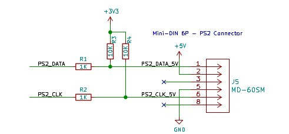

# Testing DECA Retro Cape 2 

### Tests v0.71

* 2V5 LDO gives 2.5 without connecting Deca. With Deca connected output goes to 2.74 V. With Sega megadrive connected goes to 2.64 V. Atari joystick 2.74V.

19/04/22 Test circuit amb BATs

* en buit, pin ps2_keyb_dat, a 4.8V tant amb el BAT abans con després de la R (idem resultats amb R 180 i amb R 470)

* en càrrega (deca connectada), pin ps2_keyb_dat, a 4.8V tant amb el BAT abans con després de la R (idem 180 i 470)

* Posant R pullup (i sense BATs) tal com esquema Tom Verbeure també obtinc 5V als pins FPGA. Provat amb 4k7 i 10k.    També he provat de simular impedància FPGA posant una R de 1 MOhm entre pin FPGA i GND, amb resultats similars.

25/04/22  Test esquema tipus Tom Verbeure retrocape, amb Deca connectada a la cape

Valors resistències provades: R1/2 = 470 Ohm, R3/4 = 4k7 Ohm 

* Amb jumper V-LDO  (Alimentació LDO) tot el rail de 3V3 es posa a 4.6V 
* Amb jumper V-3V3  (alimentació Deca) el rail de 3V3 continua a 3V3 
  * Pin PS2 FPGA està a 4.6 V

25/04/22 Proves divisors de tensió

* r1 470, r2 2k   només funciona teclat Logitech (usb/ps2 i l'altre no funcionen). Tensió pins fpga = 2.54V

  

#### Tests 12/05/22

* Zener 3+0.7V gives at FPGA 2.4V for my mouse and 2.8V for my keyboard, and both are working. 
* If I apply 3V3 from Deca to the BAT54 circuit it works as expected. At FPGA we have 3.6V.
  * If we could apply 3V to the BATs then we would have 3V3 at the FPGA ps2 inputs
  * When we give 3V3 or 2V5 from LDO or from a voltage divider to the BATs, then the voltage from the  BATs and all it's rail changes to 4V7

Summary:

* For ps2 use 3V6 (or 4V) zeners.  BAT54 could be used with 3V3 supplied by Deca
* For joystick 
  * Zeners work Ok with joy connected. When joy is disconnected, fpga input is 1V and it does not work applying weak pull-ups or physical pull-ups before or after the 510 resistor.
  * BAT54 does not work well with 2V5 from LDO or with a voltage divider from 5V (1k resistor R1, R2 values) as the 2V5 rail changes to 4.7V
  * If we could accept 3V3  al fpga inputs then it would work if we power supply from Deca 3V3 but it is not the case as we can only accept 2V5.

Tests 13/05/22:

* tested zener circuit with limiting resitor before and after the zener.  Weak Pull-up still not working.
* tryed quartus pin planner combinations of 2V5 schmidt trigger, 4 mA, pull-up, without success. 1.8V cannot be selected for a 2V5 bank.

Test 15/05/22

* Tornat a provar BATs amb R 1k entre fpga i R.  Mateixos efectes.
* Provat de posar un diode a la part de 5V. idem
* Provat de posar un diode a la sortida de 3v3 i alimentar el circuit de 2v5 (sense ldo). idem resultat puja tensió a 4.8V
